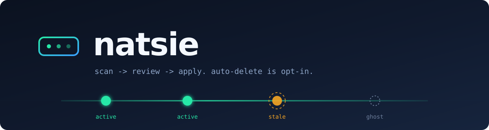

<p align="center">
  
</p>

<p align="center">
  <a href="https://github.com/1995parham/natsie/actions/workflows/ci.yaml"></a>
  <a href="https://github.com/1995parham/natsie/tags"></a>
  <a href="./LICENSE"></a>
  <a href="https://go.dev"></a>
  <a href="https://codecov.io/gh/1995parham/natsie"></a>
</p>

A Swiss-army knife for NATS operations: report on, diagnose, and (with explicit human approval) clean up consumers, streams, and cluster state across one or many JetStream clusters.

`natsie` is built for the ops engineer who has dozens of NATS contexts, recurring cluster events, and consumers that quietly outlive the services that created them. It is **never autonomous** — every destructive action requires an explicit manifest + apply step. Detection and reporting run unattended; deletion does not.

## Why another NATS tool

The ecosystem has `nats` (the official CLI), `nats-top`, and `nats-surveyor` — all focused on inspection, benchmarking, or live metrics. None of them answer the operational question that comes up after every cluster upgrade or service migration:

> Which consumers, streams, or peers are still here that *probably shouldn't be*, and what's the safest way to remove them?

`natsie` is the answer to that question. It treats cleanup like a code review: scan → propose → human approves → apply, with an audit trail.

## Status

`consumer scan`, `consumer apply`, `peer check`, `stream report`, and `bot serve` are all working.

## Subcommands (current and planned)

| Command | Status | Purpose |
| --- | --- | --- |
| `consumer scan` | **working** | Enumerate consumers across one or more contexts; classify as active / stale / abandoned with cross-cluster peer awareness; emit TSV/JSON, optionally a YAML cleanup manifest. |
| `consumer apply` | **working** | Apply a delete-manifest produced by `scan`, re-verifying each consumer first. Supports `--dry-run` and `-` (read manifest from stdin). |
| `consumer owner` | **working** | Resolve which cluster/consumer currently owns a `filter_subject` across all configured contexts (active-first), to find where a stale consumer's work moved. TSV/JSON/pretty. |
| `peer check` | **working** | Walk every stream/consumer Raft group and aggregate each server's standing; flag GHOST peers (offline in every group, leading none) from a `peer-remove` that never happened. TSV/JSON/pretty, `--ghosts-only`. |
| `stream report` | **working** | Per-stream retention/limits, replication factor, size, consumer count, and replica placement; pretty mode adds a per-server placement-skew summary. TSV/JSON/pretty, `--stream` filter. |
| `bot serve` | **working** | Long-running daemon: scheduled scans, chat notifications (Slack / Mattermost / stdout), HTTP listener with manifest viewer, slash-command handler, signed approval URLs, JSONL audit log. |

## Design pillars

1. **Never auto-deletes.** Destructive actions always require an explicit `apply <manifest>` step, and the manifest is human-readable.
2. **Cross-cluster aware.** Many production deployments run NATS in pairs or N-way groups; "consumer X is stale here, but active on the peer" is a first-class signal.
3. **Rename- and move-aware.** Consumer name conventions drift — region suffixes, environment tags, service renames. `scan` flags a stale consumer as a likely rename (`renamed_to`) when another consumer on the same stream filters the same `filter_subject` and is still active; `consumer owner` chases the same `filter_subject` across every configured context to find where the work moved, so a migration isn't mistaken for an abandoned consumer.
4. **No vendor lock-in.** Connection (NATS contexts), rules, notification sinks, and approval flows are all pluggable. Operator-specific opinions live in config, not the binary.

## Install

```bash
go install github.com/1995parham/natsie/cmd/natsie@latest
```

Or from source, with [just](https://just.systems):

```bash
git clone https://github.com/1995parham/natsie && cd natsie
just build
```

## Quick start

```bash
# Scan one cluster, emit TSV to stdout
natsie consumer scan --context prod-teh1

# Scan with cross-cluster peer awareness
natsie consumer scan --context prod-teh1 --peer-context prod-teh2

# Only report consumers idle > 24h with > 10k pending
natsie consumer scan --context prod-teh1 \
  --min-idle 24h --min-pending 10000

# Emit JSON for piping to other tools
natsie consumer scan --context prod-teh1 --format json

# Where did this filter subject's work move to? (searches every context)
natsie consumer owner "rides.trip.>"

# Ghost peers: offline in every Raft group and leading none
natsie peer check --context prod-teh1 --ghosts-only

# Per-stream retention, replication, size, and replica placement
natsie stream report --context prod-teh1 --format pretty
```

`natsie` reads from the same `~/.config/nats/context/*.json` files that `nats context` uses — no separate credential handling.

## The scan → edit → apply workflow

Deletion is gated on a hand-editable manifest. The flow:

```bash
# 1. Scan and emit a cleanup manifest of stale rows.
natsie consumer scan --context prod-teh1 \
  --peer-context prod-teh2 \
  --min-pending 10000 --min-idle 24h \
  --emit-manifest cleanup.yaml

# 2. Hand-review cleanup.yaml. Delete rows you don't want touched, or set
#    `skip: true` on rows you want to keep in the manifest as a record but
#    excluded from apply. Add `reason:` lines so future you remembers why.

# 3. Dry-run to confirm what apply would do (re-verifies each consumer).
natsie consumer apply cleanup.yaml --dry-run

# 4. Apply for real.
natsie consumer apply cleanup.yaml
```

Apply re-queries every consumer immediately before deleting it. A consumer
that has become active in the window between scan and apply — push-bound,
has pull waiters, or has acked since the manifest's `generated_at` — is
preserved. The window is the safety property that lets the bot operate
unattended later; deleting from a stale snapshot is the failure mode that
makes other cleanup tools dangerous.

## Running as a bot

`natsie bot serve` is the long-lived daemon mode. It runs scheduled scans,
posts chat messages with a signed approval URL, exposes a small HTTP
listener for the manifest viewer / slash commands / approval clicks, and
appends every action to a JSONL audit log.

### Configuration

```yaml
# ~/.config/natsie/config.yaml (or /etc/natsie/config.yaml in production)

bot:
  schedules:
    # kind defaults to consumer-stale — the only kind that produces a
    # manifest and an approve URL. The others are notify-only reports.
    - name: daily
      cron: "0 3 * * *"
      context: prod-teh1
      peer_context: prod-teh2
      min_pending: 10000
      min_idle: 24h
    - name: edge-hourly
      cron: "0 * * * *"
      context: edge-1
      min_pending: 5000
      min_idle: 6h
    - name: ghost-peers
      kind: peer-check           # peers offline in every Raft group
      cron: "*/30 * * * *"
      context: prod-teh1
    - name: unbounded-streams
      kind: stream-unlimited     # streams with no retention limit at all
      cron: "0 6 * * *"
      context: prod-teh1
    - name: replication
      kind: stream-report        # under-replicated streams
      cron: "0 7 * * *"
      context: prod-teh1

  notify:
    - mattermost://chat.example.com/hooks/abc-xyz?channel=nats-cleanup
    # - slack://hooks.slack.com/services/T.../B.../...
    # - webhook://hooks.example.com/n8n/abc   # structured JSON: {title, body, manifest_id, link}
    # - stdout://   # for local testing

  store: file:///var/lib/natsie/manifests
  audit_log: /var/lib/natsie/audit.jsonl

  http:
    listen: ":8080"
    base_url: https://natsie.example.com   # public URL used in chat links

  signing_key: change-me-to-32-random-bytes

  # Optional: route a subset of each manifest to the team that owns those
  # streams. Owner sinks get visibility only — the approve URL always goes
  # to the global notify list. First matching owner wins.
  owners:
    - name: rides
      streams: [rides, rides-dlq]
      consumer_prefix: [rides-]
      notify:
        - mattermost://chat.example.com/hooks/def-uvw?channel=rides-oncall

  # Optional: pull-mode chat transport (see below). Omit for push-mode only.
  mattermost:
    enabled: false
    server: https://chat.example.com
    token_file: /etc/natsie/mattermost-token
    team: platform
    channel: nats-cleanup
    trigger: "!natsie"
```

`signing_key` does two jobs:

- **Slash-command verification token.** Configure the same string in your
  Mattermost or Slack slash-command integration; the bot compares it
  with `crypto/subtle.ConstantTimeCompare`.
- **HMAC-SHA256 key for approval URLs.** Every approval link in chat is
  bound to its manifest ID, so a leaked URL can only approve the one
  manifest it was issued for.

### Endpoints

| Method | Path | Purpose |
| ------ | ---- | ------- |
| `GET`  | `/healthz` | JSON `{"status":"ok"}` for load-balancer probes. |
| `GET`  | `/metrics` | Prometheus metrics: scan duration & candidate counts, apply outcomes, approval latency, build info. |
| `GET`  | `/manifest/{id}` | Returns the stored manifest as `application/yaml`. |
| `POST` | `/slash` | Slash-command handler (see [chat commands](#chat-commands)). Token-protected. |
| `GET`  | `/approve/{id}?token=...` | Renders a plain-text preview of what would be deleted. |
| `POST` | `/approve/{id}?token=...` | Re-verifies + applies. Returns JSON summary. |

### Chat commands

Both chat transports (see below) share one dispatcher, so the vocabulary is
identical whichever one you run:

```
list                      list stored manifest IDs
show <id>                 preview a manifest
clusters                  list NATS contexts this bot can dial
streams [ctx]             list streams (one context, or all of them)
stream <ctx> <name>       single-stream detail
last <ctx> <stream> [sub] metadata for the last message on a subject
consumers <ctx> <stream>  all consumers on a stream, unfiltered
usage [ctx]               aggregate footprint + top streams by bytes
cluster <ctx>             connected server, peers, account
scan <ctx> [stream]       on-demand scan; replies with a signed approve URL
help                      this list
```

### Chat transports: push or pull

Pick based on whether your chat server can reach the bot.

**Push (slash command).** Chat POSTs `/slash` on the bot; needs an ingress
the chat server can reach. Configure `/natsie` in Mattermost or Slack to
POST to `https://<your-host>/slash` with `signing_key` as the token:

```
/natsie list
/natsie scan prod-teh1
```

**Pull (WebSocket).** The bot opens an outbound WebSocket to Mattermost with
a bot-account token, watches one channel for messages starting with
`trigger`, and replies over REST. No inbound route needed — use this when
natsie sits behind an ingress your chat server cannot reach. Enable the
`bot.mattermost` block above, then from the channel:

```
!natsie list
!natsie scan prod-teh1
```

The bot account must be a member of the team *and* the channel it should
listen on; being a webhook target is not enough. A Mattermost outage is
recoverable — the listener retries with backoff while the scheduler and
HTTP listener keep running.

### Audit log

Every scan run, approval preview, and apply attempt is appended as one
JSON object per line to `bot.audit_log`. Rotate it with logrotate or
similar; the bot opens the file in append mode and does not hold an
exclusive lock.

### Kubernetes

A minimal Deployment + Service + ConfigMap, with the config mounted
into `/etc/natsie/config.yaml`:

```yaml
apiVersion: apps/v1
kind: Deployment
metadata: { name: natsie }
spec:
  replicas: 1                          # do not scale > 1; schedules + store assume single-writer
  selector: { matchLabels: { app: natsie } }
  template:
    metadata: { labels: { app: natsie } }
    spec:
      containers:
        - name: natsie
          image: ghcr.io/1995parham/natsie:latest
          args: ["bot", "serve", "--config", "/etc/natsie/config.yaml"]
          ports: [{ containerPort: 8080 }]
          volumeMounts:
            - { name: config,    mountPath: /etc/natsie }
            - { name: state,     mountPath: /var/lib/natsie }
            - { name: nats-ctx,  mountPath: /root/.config/nats }
          livenessProbe:
            httpGet: { path: /healthz, port: 8080 }
      volumes:
        - { name: config,   configMap: { name: natsie-config } }
        - { name: state,    persistentVolumeClaim: { claimName: natsie-state } }
        - { name: nats-ctx, secret:    { secretName: natsie-nats-contexts } }
```

The `natsie-nats-contexts` Secret should contain the same `*.json` files
the official `nats context` CLI writes — one per cluster, with the
credentials inline. The bot does not run as a NATS account by itself; it
borrows whatever the operator already trusts.

## Project layout

```
.
├── cmd/natsie/             # binary entrypoint (main.go)
├── internal/
│   ├── cmd/                # urfave/cli v3 command tree
│   │   ├── consumer/       # consumer scan / apply / owner
│   │   ├── peer/           # peer check
│   │   ├── stream/         # stream report
│   │   └── bot/            # bot serve
│   ├── infra/
│   │   ├── config/         # koanf loader (defaults → yaml → env)
│   │   ├── natsctx/        # ~/.config/nats/context reader + dialer
│   │   ├── httpsrv/        # echo listener: manifests, slash, approvals
│   │   ├── mattermost/     # pull-mode WebSocket listener
│   │   ├── notify/         # mattermost / slack / webhook / stdout sinks
│   │   ├── scheduler/      # cron wrapper
│   │   ├── store/          # manifest store (file://)
│   │   └── metrics/        # Prometheus collectors
│   ├── scanner/            # classification, renames, peers, stream report
│   ├── manifest/           # YAML manifest schema + read/write
│   ├── cleanup/            # re-verify + delete
│   ├── chatops/            # transport-agnostic chat commands
│   ├── owners/             # stream/prefix → owner routing
│   ├── audit/              # JSONL audit log
│   └── version/            # build info
├── chart/                  # Helm chart for `bot serve`
├── assets/                 # README banner
├── .github/workflows/      # ci, release, codeql
├── Dockerfile              # multi-stage, distroless runtime
├── justfile                # build, test, lint, tidy, dev, docker
└── .golangci.yml           # linter config
```

## License

GPL-3.0-only. See [LICENSE](LICENSE).
